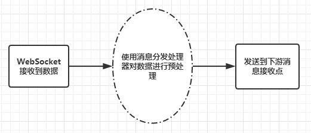

## 介绍
WebSocket 3.0 版本经过这段时间的开发终于完成并且通过测试，相比较于 2.0 版本有了很大的改动，程序的健壮性与扩展性有了很大的提高。

[](https://996.icu) [-blue.svg)](https://github.com/996icu/996.ICU/blob/master/LICENSE) [](http://hits.dwyl.io/0xZhangKe/WebSocketDemo)

实际上，以前的版本很大程度上都是为了应付公司业务而做的，顺手开源出来，但我发现随着使用者越来越多，问题也逐渐凸显出来，再加上经过前段时间的学习技术上有了长足的进步，就想着把这个给重构一遍。

其实做这个技术上并没有什么技术上的难点，但是要做开源，要给别人用，就会有很大的挑战。不仅要考虑到程序的健壮性，还要考虑如何用最简单的方式，给用户提供更多的功能，并且兼顾到可扩展性。

我之前花了很长时间研究过设计模式相关的东西，也读了一些框架的源码，所以我的技术也一直更偏向于架构设计方向，这个框架中也用到了很多设计模式相关知识点。

3.0 版本的开发时间也不过一个月左右，但实际上我在开发之前就花了很久考虑如何设计架构，因为核心实现方式变了，所以几乎一切都是从零开始。最终选定了现在的方案，也是现阶段我能想到的最佳方案。

## 3.0 版本的改动
最主要的变动是核心实现方式从 Service 变更为独立线程，解决了新版本 Android 系统启动 Service 的问题以及可以准确控制连接的启动与断开。

所以因为核心方式变了也就没有 BaseWebSocketActivity 以及相关概念，所有对 WebSocket 相关的操作都是通过 [WebSocketHandler](websocketlib/src/main/java/com/zhangke/websocket/WebSocketHandler.java) 来实现的。

现在 WebSocketHandler 是个很重要的概念，我们无论是 WebSocket 的初始化、创建连接、断开连接、数据收发等等都要使用它来实现，其中具体的方法列表[点此查看文档](doc)。

如果您还在使用 2.0 版本，那么[请点击这里查看 2.0 版本](https://github.com/0xZhangKe/WebSocketDemo/tree/2.2)。

## 如何集成
这一点与以前一样，也有两种使用方式。

### Gradle 方式集成
在对应 model 的 build.gradle 中添加依赖：
```
implementation 'com.github.0xZhangKe:WebSocketDemo:3.1'
```

然后 sync 一下，如果出现类似的错误：
```
Failed to resolve: com.github.0xZhangKe:WebSocketDemo:3.1
```

那意味着你还没添加 Github 的仓库，到项目根目录中的 build.gradle 中添加如下代码：
```
maven { url = 'https://jitpack.io' }
```

### 第二种集成方式
这个就很简单了，直接把 websocketlib 中的代码拷贝到自己的项目中就行，具体怎么做就看你的个人喜好。

## 开始使用
此时你已经把框架集成到项目中了，再经过简单的几步配置即可使用。

### 基本配置
首先，最基本的，我们要配置 WebSocket 连接地址，要说明的是，关于 WebSocket 的相关配置都在 [WebSocketSetting](websocketlib/src/main/java/com/zhangke/websocket/WebSocketSetting.java) 中。
我们通过如下的代码设置连接地址：
```java
WebSocketSetting setting = new WebSocketSetting();
//连接地址，必填，例如 wss://localhost:8080
setting.setConnectUrl("your connect url");
```
除了连接地址之外，WebSocketSetting 中还提供了很多相关配置，我挑几个重要的说一下。
```java
//设置连接超时时间
setting.setConnectTimeout(10 * 1000);

//设置心跳间隔时间
setting.setConnectionLostTimeout(60);

//设置断开后的重连次数，可以设置的很大，不会有什么性能上的影响
setting.setReconnectFrequency(40);

//设置 Headers
setting.setHttpHeaders(header);

//设置消息分发器，接收到数据后先进入该类中处理，处理完再发送到下游
setting.setResponseProcessDispatcher(new AppResponseDispatcher());
//接收到数据后是否放入子线程处理，只有设置了 ResponseProcessDispatcher 才有意义
setting.setProcessDataOnBackground(true);

//网络状态发生变化后是否重连，
//需要调用 WebSocketHandler.registerNetworkChangedReceiver(context) 方法注册网络监听广播
setting.setReconnectWithNetworkChanged(true);
```
上面基本上包含了我们常用的一些配置了，详细介绍可[查看文档](https://github.com/0xZhangKe/WebSocketDemo/tree/3.0/doc)，或者直接问我。

### 初始化与连接
设置好之后就可直接开始连接啦，上面说过连接使用 WebSocketHandler 来操作，具体如下：
```java
//通过 init 方法初始化默认的 WebSocketManager 对象
WebSocketManager manager = WebSocketHandler.init(setting);
//启动连接
manager.start();
```
我这里提供一个可以用来测试 WebSocket 的地址：
```
wss://echo.websocket.org
```
这是国外一个专门用来测试 WebSocket 的网站，同样也支持[在线测试](https://www.websocket.org/echo.html)。

我们对 WebSocket 的连接管理、数据收发，本质上是使用 [WebSocketManager](websocketlib/src/main/java/com/zhangke/websocket/WebSocketManager.java) 来实现。
上面的 WebSocketHandler.init(setting) 方法也是为了获取一个默认的 WebSocketManager 对象。

此时默认的 WebSocketManager 已经初始化并且正在连接了，一般来说都是启动 APP 同时建立 WebSocket 连接，所以建议上述配置及初始化代码放在 Application 中运行。

后面我们需要使用 WebSocketManager 收发数据、管理连接时直接通过下面的代码即可获取到实例：
```java
//通过此方法获取默认的 WebSocketManager 对象
WebSocketManager manager = WebSocketHandler.getDefault();
```


### 数据收发
当我们初始化完成后，即可使用默认的 WebSocketManager 来进行发送数据与接收数据。
WebSocketManager 中提供了一系列的 send 方法用于发送数据：
```java
//发送 String 数据
void send(String text);
//发送 byte[] 数据
void send(byte[] bytes);
//发送 ByteBuffer 数据
void send(ByteBuffer byteBuffer);
```
除了上述三个常规的发送数据方法外，还提供了用于发送 ping/pong 的方法：
```java
//发送 ping
void sendPing();
//发送 pong
void sendPong();
//发送 pong
void sendPong(PingFrame pingFrame);
```
以及两个可自定义的帧数据发送方法：
```java
//发送 Framedata
void sendFrame(Framedata framedata);
//发送 Framedata 集合
void sendFrame(Collection<Framedata> frameData);
```
上面的几个发送数据的方法基本上囊括了所有应用场景，那么说完了发送数据再来说接收数据。

数据的接收通过对 WebSocketManager 添加 [SocketListener](websocketlib/src/main/java/com/zhangke/websocket/SocketListener.java) 监听器来实现。
我们通过如下代码添加数据接收监听器：
```java
manager.addListener(socketListener);
```
SocketListener 中的回调方法较多，为了节省篇幅我就挑两个重要的讲一下：
```java
// 数据发送失败
void onSendDataError(ErrorResponse errorResponse);
//接收到文本消息
<T> void onMessage(String message, T data);
//接收到二进制消息
<T> void onMessage(ByteBuffer bytes, T data);
```
第一个发送失败方法 onSendDataError 指的是 WebSocket 未连接或其他愿意导致数据未发送成功，ErrorResponse 中包含了失败的原因。

onMessage(String, T) 方法显然是接收到 String 类型消息的回调，那泛型 T 是什么意思呢？T 是消息分发器中处理完成后返回的数据，具体后面会介绍。

onMessage(ByteBuffer, T) 方法类似上面说的，只不过收到的是 ByteBuffer 类型的数据。

另外还有一点，因为 SocketListener 接口中的方法比较多，大多数场景下我们是不需要使用这么多方法的，所以我又提供了一个 [SimpleListener](websocketlib/src/main/java/com/zhangke/websocket/SimpleListener.java) 抽象基类，里面实现了 SocketListener 中的所有方法，你可以按需使用。

那么到这里关于数据的接收就说完啦。

### 消息处理分发器
消息分发器在这里是个很重要的概念，这是用来在接收到消息后进行预处理，然后再回调给各个接收点的中间件。
这里放一张流程图帮助理解：



那么关于消息处理器应该如何使用呢，其实非常简单，我在上面配置信息那里也讲到了 IResponseDispatcher 接口。
首先需要定义一个实现了该接口的类，然后创建一个该类的实例，在 WebSocket 配置时调用 setting.setResponseProcessDispatcher 方法将该实例设置进去即可。

关于他的使用场景，具体而言，我们在接收到数据时应该对数据进行统一的处理判断，然后再将其发送到下游接收点，处理数据时会将数据转换为统一的数据结构，具体的结构根据公司业务有所不同。

我们主要关注其中两个方法：
```java
// 接收到文本消息
void onMessage(String message, ResponseDelivery delivery);
//接收到二进制消息
void onMessage(ByteBuffer byteBuffer, ResponseDelivery delivery);
```
这里出现了一个陌生的概念：[ResponseDelivery](websocketlib/src/main/java/com/zhangke/websocket/dispatcher/ResponseDelivery.java)。

ResponseDelivery 是数据发射器，其继承上述的 [SocketListener](websocketlib/src/main/java/com/zhangke/websocket/SocketListener.java) 接口，另外有提供了几个其他的方法，用它可以将数据发送到各个接收点，我们在处理完数据之后需要使用它把数据发送出去。
与上面 IResponseDispatcher 中两个方法对应的，这里也有几个方法，同样我也只挑几个重点：
```java
//接收到文本消息
<T> void onMessage(String message, T data);
//接收到二进制消息
<T> void onMessage(ByteBuffer bytes, T data);
//数据发送失败
void onSendDataError(ErrorResponse errorResponse);
```
我们在 IResponseDispatcher 中处理完数据后，就通过上面的几个方法发送出去，这里我主要说一下 onMessage 方法中的泛型 T。

我们在处理数据时可能会将数据先转成一个 JSON，或者转成一个实体类，然后判断 code 值等等，一切都 ok 再发送出去，如果发现需要重新登录可能就直接跳到登录页面去并且拦截掉该条消息。
那么这里的泛型 T 对应的就是处理后的数据，我们可以把数据发送出去，后面就省得再做一次转换。
关于这个的具体使用案例可以[点击这里查看](samples/dispatersample/src/main/java/com/zhangke/smaple/dispatersample/AppResponseDispatcher.java)。

另外，消息处理器默认是不会开启的，接收到消息直接发送到各个接收点。

### 对多个 WebSocket 连接的支持
上面我经常提到一个概念就是默认的 WebSocket 连接，那除了默认的还有别的了吗？当然是有的了，考虑到要连接多个 WebSocket 的场景，3.0 版本特地对此做了支持。
WebSocketHandler.init(WebSocketSetting) 方法用来初始化默认的连接，同时还有另一个初始化方法：
```java
/**
 * 通过唯一标识符新建一个 WebSocket 连接
 *
 * @param key     该 WebSocketManager 的唯一标识符，
 *                后面需要通过这个 key 来获取到对应的 WebSocketManager
 * @param setting 该连接的相关设置参数
 */
WebSocketManager initGeneralWebSocket(String key, WebSocketSetting setting)
```
除了需要一个 WebSocketSetting 之外还需要一个 String 类型的 key，对于除了默认 WebSocket 连接之外的连接，这里用 key 来标识，每一个 key 对应一个连接，内部使用一个散列表维护。
当我们初始化完成后需要收发数据时通过如下代码获取 WebSocketManager 实例即可：
```java
/**
 * 获取 WebSocketManager 对象
 *
 * @param key 该 WebSocketManager 的 key
 * @return 可能为空，代表该 WebSocketManager 对象不存在或已移除
 */
WebSocketManager getWebSocket(String key);
```

获取到 WebSocketManager 之后其它操作就跟上面说的完全一样了。
使用完记得及时关闭连接并移除。

### 心跳机制
WebSocket 通过发送 ping/pong 来确保连接的可用，客户端发送 ping 帧，服务端响应 pong 帧。
框架中默认的心跳间隔是 60 秒一次，我们可以通过如下代码设置间隔时间：
```java
//设置心跳间隔时间
setting.setConnectionLostTimeout(50);
```
特别的，如果不需要这个心跳机制可以将参数设置为 0 关闭心跳。

## 声明
本框架是基于 [Java-WebSocket](https://github.com/TooTallNate/Java-WebSocket) 的二次开发，针对 Android 平台做了一层封装，目的为了简化客户端的使用，算是 WebSocket 与业务层的一个中间桥接层。

大家可以关注下我的公总号，会经常更新一些干货文章：

